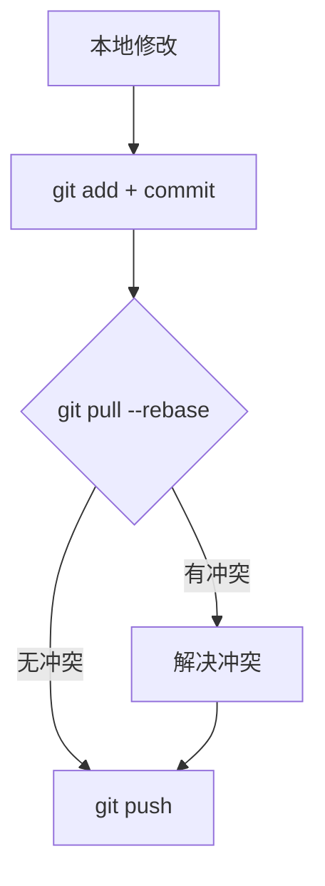

# Git冲突处理流程

## git pull本地拉取远程仓库冲突

### 主要三种解决方法：

### **选项 1：合并（保留所有提交历史，推荐新手使用）**  
```bash
git pull --no-rebase
# 或者设置成默认行为（以后都使用 merge 方式代码如下）
git config --global pull.rebase false
```
**适用情况**：适合团队协作或希望保留完整历史记录的情况。  
**结果**：Git 会创建一个新的“合并提交”来整合两边的修改。  

---

### **选项 2：变基（让提交历史更整洁）**  
```bash
git pull --rebase
# 或者设置成默认行为（以后都使用 rebase 方式代码如下）
git config --global pull.rebase true
```
**适用情况**：希望提交历史保持线性、避免多余的合并提交（适合个人项目或团队统一规范）。  
**结果**：Git 会把你本地的提交“挪到”远程最新提交之后，使历史更清晰。  

---

### **选项 3：仅快进（拒绝分叉，必须手动处理）**  
```bash
git pull --ff-only
# 或者设置成默认行为
git config --global pull.ff only
```
**适用情况**：严格保持分支同步，拒绝自动合并或变基（适合高级用户）。  
**结果**：如果分支有分叉，Git 会直接报错，要求你先手动处理冲突。  

---

### **如何选择？**
- **新手建议**：先用 `git pull --no-rebase`（合并），这样不会丢失历史。  
- **追求整洁历史**：用 `git pull --rebase`（变基），但需要熟悉冲突解决。  
- **严格模式**：用 `git pull --ff-only`，适合需要精确控制分支的情况。  

## 如果遇到冲突，Git 会提示你，解决后记得 `git add` 和 `git commit`（或 `git rebase --continue`）。
---
> ## 如果你使用了 `git config --global pull.rebase true`，这意味着：  

1. **全局设置**：所有 Git 仓库的 `git pull` 默认都会采用 `--rebase`（变基）方式，而不是 `merge`（合并）。  
2. **效果**：每次 `git pull` 时，Git 会尝试把你的本地提交“重新播放”在远程分支的最新提交之上，保持提交历史线性整洁，避免多余的合并提交（`Merge branch 'main' of ...`）。  

---

### **可能出现的情况**
#### **1. 正常情况（无冲突）**
如果本地和远程的修改没有冲突，`git pull --rebase` 会自动：
- 拉取远程最新代码  
- 把你的本地提交“挪到”最新提交之后  

#### **2. 遇到冲突**
如果远程提交和你的本地提交修改了同一部分代码，Git 会暂停变基，提示冲突：  
```
CONFLICT (content): Merge conflict in <file>
...
You need to resolve the conflicts and then run:
git rebase --continue
```

---

### **如何解决冲突？**
1. **手动解决冲突**  
   - 打开冲突文件（Git 会用 `<<<<<<<`、`=======`、`>>>>>>>` 标记冲突部分）  
   - 修改代码，保留你想要的更改，并删除冲突标记  

2. **标记冲突已解决**  
   ```bash
   git add <冲突的文件>
   ```

3. **继续变基**  
   ```bash
   git rebase --continue
   ```

4. **如果想放弃变基**（回到 rebase 之前的状态）  
   ```bash
   git rebase --abort
   ```

---

### **注意事项**
✅ **优点**  
- 提交历史更干净，没有多余的合并提交  
- 适合个人项目或团队统一规范  

❌ **缺点**  
- 如果冲突较多，可能需要频繁手动解决  
- 变基会改写提交历史，**不要在公共分支（如 `main`）上对已推送的提交做变基**，否则可能影响他人  

---
### **如果想改回默认合并（merge）方式**
```bash
git config --global pull.rebase false
```
这样 `git pull` 就会恢复成默认的 `merge` 行为。 
---
**效果**：  
- 以后执行 `git pull` 时，Git 会使用 `merge` 方式（而不是 `rebase`）。  
- 如果本地和远程有分叉，会生成一个合并提交（`Merge branch 'main' of ...`）。  

---

### **方法 2：临时使用 `--no-rebase`（仅当前 `pull` 生效）**
如果你只是**某一次**想用 `merge` 方式，可以运行：  
```bash
git pull --no-rebase
```
**效果**：  
- 仅这次 `pull` 使用 `merge`，不影响全局配置。  

---

### **方法 3：完全删除 `pull.rebase` 配置（恢复 Git 默认行为）**
如果想彻底移除 `pull.rebase` 设置，让 Git 使用默认行为（通常是 `merge`）：  
```bash
git config --global --unset pull.rebase
```
**效果**：  
- Git 会恢复默认的 `pull` 行为（取决于版本，通常是 `merge`）。  

---
### **验证当前配置**
你可以用以下命令查看当前的 `pull` 策略：  
```bash
git config --global pull.rebase
```
- 如果返回 `false` 或空白，说明 `git pull` 默认使用 `merge`。  
- 如果返回 `true`，说明仍然使用 `rebase`。  

---

### **总结**
| 需求 | 命令 |
|------|------|
| **永久改回 `merge`** | `git config --global pull.rebase false` |
| **临时用 `merge`（仅本次）** | `git pull --no-rebase` |
| **删除配置（恢复默认）** | `git config --global --unset pull.rebase` |

如果你只是想偶尔用 `merge`，推荐**方法 2**（临时加 `--no-rebase`）。  
如果想彻底改回默认 `merge`，就用**方法 1**。 😊
---
当你运行 `git pull` 时，Git 实际上会执行两个操作：
1. `git fetch` - 从远程仓库获取最新代码
2. `git merge` 或 `git rebase` - 将远程更改与本地更改合并

### 如果设置了 `pull.rebase true`
由于你设置了 `git config --global pull.rebase true`，所以：
```bash
git pull
```
等价于：
```bash
git pull --rebase
```
### 与 `git pull --no-rebase` 的区别
| 行为 | `git pull` (rebase=true) | `git pull --no-rebase` |
|------|-------------------------|-----------------------|
| 合并方式 | 变基 (rebase) | 合并 (merge) |
| 提交历史 | 线性，无合并提交 | 可能有合并提交 |
| 冲突处理 | 在rebase过程中逐个提交处理 | 一次性处理所有冲突 |
| 适合场景 | 个人分支/保持历史整洁 | 团队协作/公共分支 |

---

### 关键区别：替换 vs. 合并
| 行为                | 是否"替换"本地内容？ | 是否保留双方修改？ | 提交历史              |
|---------------------|----------------------|--------------------|-----------------------|
| `git pull --no-rebase` | ❌ 否                | ✅ 是              | 可能有合并提交        |
| `git pull --rebase`   | ❌ 否（但重写历史）   | ✅ 是              | 线性，无合并提交      |
| `git reset --hard origin/main` | ✅ 是（强制覆盖） | ❌ 否              | 完全同步远程          |

---

### 什么时候会真正“替换”本地内容？
只有以下命令会 **强制用远程内容覆盖本地**（慎用！）：
```bash
git fetch origin
git reset --hard origin/main  # 丢弃所有本地修改，完全同步远程
```
这会：
- 丢弃所有未提交的本地更改。  
- 使本地分支完全匹配远程分支（包括提交历史）。  

---
### **⚠️ 强制覆盖本地修改的命令清单**
| 场景 | 命令 | 影响范围 |
|------|------|----------|
| **丢弃未暂存的修改** | `git checkout -- <文件>` | 单个文件 |
| **丢弃所有未暂存修改** | `git restore .` | 全部文件 |
| **丢弃所有未提交的修改（含已暂存）** | `git reset --hard` | 全部文件 |
| **完全同步远程分支（核选项）** | `git fetch && git reset --hard origin/main` | 分支级覆盖 |

---

### 总结
- `git pull`（无论 merge 还是 rebase）**不会直接替换本地内容**，而是智能合并。  
- 只有 `git reset --hard` 会强制覆盖本地内容。  
- 合并冲突时，Git 会提示你手动选择保留哪部分代码（不会自动丢弃任何一方的修改）。  

如果希望保持干净历史，用 `rebase`；如果希望保留完整合并记录，用 `merge`。

## 解决本地拉取远程仓库，终极解决方案:

```
# 替代方案：用 rebase 避免强制推送
git pull --rebase
git push
```
**以下方法慎重**

远程仓库内容强制覆盖本地内容
```
git reset --hard
```
---


## gti  push 本地推送远程仓库冲突

当 `git push` 遇到冲突时，说明远程分支已经有了你本地没有的新提交（可能是其他协作者推送的），而你的本地提交与这些新提交存在冲突。以下是完整的解决步骤：

---

### **1. 先拉取最新代码（必须操作）**
```bash
git pull
```
Git 会尝试自动合并，但如果有冲突，你会看到类似这样的提示：
```
CONFLICT (content): Merge conflict in <文件名>
Automatic merge failed; fix conflicts and then commit the result.
```

---

### **2. 解决冲突**
#### （1）查看冲突文件
Git 会在冲突文件中用标记标出冲突位置：
```
<<<<<<< HEAD
你的本地代码
=======
远程仓库的代码
>>>>>>> commit-hash
```
- `<<<<<<< HEAD` 和 `=======` 之间是你的本地修改  
- `=======` 和 `>>>>>>> commit-hash` 之间是远程的修改  

#### （2）手动编辑文件
选择保留需要的代码（或合并两者），删除冲突标记。例如：
```python
# 保留本地和远程的修改（合并后）
def hello():
    print("你的本地修改")
    print("远程的修改")
```

#### （3）标记冲突已解决
```bash
git add <冲突的文件>
# 如果是多个文件冲突，可以一次性添加所有
git add .
```

---

### **3. 完成合并**
#### 如果用的是 `git pull`（默认 merge 方式）：
```bash
git commit -m "Merge remote changes"
```
Git 会自动生成一个合并提交。

#### 如果用的是 `git pull --rebase`：
```bash
git rebase --continue
```
这样会保持线性历史，不会生成合并提交。

---

### **4. 重新推送**
```bash
git push origin <分支名>
```
如果之前因为冲突导致推送失败，现在应该可以成功。

---

### **特殊情况处理**
#### 如果冲突复杂想放弃合并：
```bash
# 如果是 merge 方式
git merge --abort

# 如果是 rebase 方式
git rebase --abort
```
这会回到 `git pull` 之前的状态。

---
### **如何避免未来冲突？**
1. **频繁拉取更新**：  
   ```bash
   git pull --rebase
   ```
   保持本地代码与远程同步。

2. **小步提交**：避免一次性提交大量改动。

3. **沟通协作**：和团队成员协调修改同一文件的时机。

---

### **总结流程**
```
git pull → 解决冲突 → git add → git commit/rebase --continue → git push
```
关键点：**永远不要强制推送（`--force`）**，除非你明确知道后果！

---
### 发生冲突解决方案

### **🔧 解决方案（任选一种）**

#### **方法 1：先拉取再推送（推荐）**
```bash
# 1. 拉取远程最新代码并合并（merge 方式）
git pull origin main

# 如果出现冲突，手动解决后：
git add .
git commit -m "Merge remote changes"

# 2. 重新推送
git push origin main
```

#### **方法 2：用变基保持线性历史**
```bash
# 1. 拉取远程代码并变基（避免合并提交）
git pull --rebase origin main

# 如果冲突，解决后：
git add .
git rebase --continue

# 2. 强制推送（仅限个人分支！）
git push origin main --force-with-lease
```

#### **方法 3：强制覆盖远程（⚠️ 危险！仅限私有分支）**
```bash
# 丢弃本地所有未提交修改，完全同步远程
git fetch origin
git reset --hard origin/main

# 重新应用你的修改（如果有），然后推送
git push origin main
```

---

### **📝 原因解析**
- **为什么会被拒绝？**  
  远程分支（如 `main`）已被其他人更新，而你的本地分支基于旧版本。Git 默认禁止这种非快进（non-fast-forward）推送，防止覆盖他人代码。

- **`--force-with-lease` 比 `--force` 安全在哪？**  
  它会检查远程分支是否有你未知的新提交，避免覆盖队友的代码。

---

### **💡 预防建议**
1. **推送前先拉取**：养成 `git pull --rebase` 的习惯。
2. **小步频繁提交**：减少大范围冲突的概率。
3. **团队协作规范**：公共分支（如 `main`）禁止强制推送。

---

### **🛠️ 冲突处理技巧**
如果 `git pull` 后出现冲突：
1. 用 `git status` 查看冲突文件。
2. 手动编辑文件，保留需要的代码（删除 `<<<<<<<` 等标记）。
3. 标记已解决：
   ```bash
   git add <文件>
   git commit  # 或 git rebase --continue
   ```

---

选择方法 1 最安全，方法 2 适合个人分支，方法 3 是最后的核选项！

---
### **附：如果误操作如何恢复？**
如果 rebase 中途出错，可以用以下命令回到操作前的状态：
```bash
git rebase --abort
``` 

**记住黄金法则**：  
> 只对 **未推送** 的本地提交做 rebase，已推送的提交用 merge。


---

### **📌 推荐工作流（防冲突版）**
```bash
# 1. 提交所有本地修改（必须）
git add .
git commit -m "你的提交说明"

# 2. 拉取远程最新代码（关键！）
git pull --rebase origin main

# 3. 处理可能出现的冲突（如果有）
#   - 手动解决冲突文件（搜索 <<<<<<< 标记）
#   - 标记已解决：
git add <冲突文件>
git rebase --continue

# 4. 推送到远程
git push origin main
```

---

### **🌰 场景模拟**
假设你正在修改个人博客（带 CI 自动构建）：
1. 你本地修改了 `index.md` 并提交  
2. **同时** GitHub Actions 自动更新了 `_config.yml`  
3. 你的推送流程：
   ```bash
   git add index.md
   git commit -m "更新文章"
   git pull --rebase origin main  # 此时会包含远程的 _config.yml 更新
   git push origin main
   ```
   结果：你的文章更新和 CI 的配置更新完美合并。

---

### **💡 关键技巧**
1. **总是先 `pull --rebase` 再 `push`**  
   - 避免直接 `push` 被拒绝
   - 保持提交历史线性（无多余合并提交）

2. **处理冲突的快捷方式**  
   ```bash
   # 查看冲突文件
   git status

   # 用编辑器（如 VS Code）直接解决冲突
   code .
   # 然后保存文件，运行：
   git add .
   git rebase --continue
   ```

3. **自动化工作流干扰？**  
   如果 CI/CD 频繁修改远程仓库：
   - 在推送前手动触发一次工作流运行，确保远程状态最新
   - 或设置工作流避开你活跃开发的时间段

---

### **⚠️ 危险操作（避免！）**
```bash
# 不要直接强制推送（会覆盖工作流的修改！）
git push --force

# 除非你100%确定远程修改无用，且使用安全强制推送
git push --force-with-lease
```

---

### **🔄 无冲突理想情况**
如果远程无新提交，流程简化为：
```bash
git add .
git commit -m "消息"
git push origin main
```

---

### **总结**

记住：**先拉取，再推送**，个人仓库也要像协作仓库一样规范操作！

---

## 解决本地拉取远程，终极解决方案:

```
git add .
git commit -m "日常更新"
git pull --rebase origin main
git push origin main

```
**以下方法慎重**

强制推送（覆盖远程更改)

```
git push --force
```


## Termux多个 Git 命令合并为一步
### **方案 1：使用 Shell 别名（推荐）**
在 Termux 中编辑 `~/.bashrc` 或 `~/.zshrc`：
```bash
echo 'alias gitup="git add . && git commit -m 日常更新 && git pull --rebase origin main && git push origin main"' >> ~/.bashrc
source ~/.bashrc
```
之后只需执行：
```bash
gitup
```
::: warning 注意

这里的 `gitup` 可以随意取值,只是设置的一个变量名。

::: 

---

### **方案 2：编写脚本文件**
1. 创建脚本文件：
   ```bash
   nano ~/git-update.sh
   ```
2. 写入内容：
   ```bash
   #!/bin/bash
   git add .
   git commit -m "日常更新"
   git pull --rebase origin main
   git push origin main
   ```
3. 添加执行权限：
   ```bash
   chmod +x ~/git-update.sh
   ```
4. 运行：
   ```bash
   ~/git-update.sh
   ```

---
### **✅ 正确操作步骤**
1. **编辑 `.zshrc` 文件**
   ```bash
   nano ~/.zshrc
   ```
2. **在文件末尾添加**（推荐以下优化版）：
   ```bash
   alias gitup='{
    echo "🚀 开始一键同步..." &&
    git add . &&
    git commit -m "日常更新 $(date +"%Y-%m-%d %H:%M")" &&
    git pull --rebase origin main &&
    git push origin main &&
    echo "✅ 同步完成！"
} || {
    echo "❌ 出错了！请手动解决冲突后继续"；
    git status
}'
   ```
   > 📝 注意：建议使用单引号包裹整个命令，双引号包裹提交信息（避免特殊字符解析问题）
**特点**：
- 添加时间戳到提交信息
- 有成功/失败提示
- 出错时自动显示状态

---

### **🛠️ 故障排除**
如果别名不生效：
1. 检查是否在用 zsh：
   ```bash
   echo $SHELL
   ```
2. 如果用的是 bash，改为编辑 `~/.bashrc`

3. 检查文件权限：
   ```bash
   chmod 644 ~/.zshrc
   ```

---
### **📦 高级扩展**
如果想更强大，可以创建函数：
```bash
gitup() {
    local msg=${1:-"日常更新"}
    git add . && git commit -m "$msg" && git pull --rebase origin main && git push origin main
}
```
用法：
```bash
gitup          # 使用默认提交信息
gitup "修复BUG" # 自定义提交信息
```

---

### **💡 最佳实践建议**
1. **首次使用时分步测试**：
   ```bash
   git add . && git commit -m "测试"
   git pull --rebase origin main
   git push origin main
   ```
2. **重要操作前备份**：
   ```bash
   git stash save "备份-$(date +%s)"
   ```

现在只需输入 `gitup`，你的 Termux 就能自动完成全套操作了！如有其他需求可以继续优化这个别名 ✨

---

## **🐣 新手友好版冲突解决流程**
#### 第1步：触发冲突后先暂停
当你执行 `git pull --rebase` 看到类似这样的冲突提示时：
```
CONFLICT (content): Merge conflict in README.md
Auto-merging README.md
Rebase stopped at 123abc... commit message
```
➔ **不要执行任何其他命令**，先专注解决冲突

---

#### 第2步：用可视化工具解决冲突（最简单！）
1. **打开 VS Code（或其他编辑器）**
   ```bash
   code .
   ```
2. **在编辑器左侧文件列表中找到冲突文件**（会有 ⚠️ 警告图标）
3. **你会看到被标记的冲突部分**，例如：
   ```markdown
   <<<<<<< HEAD
   我的本地修改
   =======
   远程仓库的修改
   >>>>>>> 123abc
   ```
4. **鼠标点击选择要保留的修改**：
   - 点击 `Accept Current Change`（保留本地）
   - 点击 `Accept Incoming Change`（保留远程）
   - 或 **手动编辑** 成你想要的样子（比如合并两部分）

---

#### 第3步：告诉 Git 冲突已解决
1. **在 VS Code 保存所有文件**（Ctrl+S / Cmd+S）
2. **回到终端执行**：
   ```bash
   git add README.md  # 替换为你的冲突文件名
   ```
   或添加所有解决过的文件：
   ```bash
   git add .
   ```

---

#### 第4步：继续未完成的 rebase
```bash
git rebase --continue
```
如果还有其他提交需要处理，重复第2-3步  
（如果不想继续了，可以用 `git rebase --abort` 取消整个操作）

---

#### 第5步：完成推送
```bash
git push origin main
```

---

### **📚 新手常见问题解答**
**Q1：不小心搞乱了冲突文件怎么办？**  
➔ 用这个命令恢复文件到冲突初始状态：
```bash
git checkout --ours README.md   # 恢复成本地版本
git checkout --theirs README.md # 恢复成远程版本
```

**Q2：冲突时看到一堆奇怪的文件怎么办？**  
➔ 只处理你认识的文件！其他文件可能是自动生成的，可以这样操作：
```bash
git add package-lock.json  # 常见的自动生成文件
git rebase --continue
```

**Q3：还是不敢操作怎么办？**  
➔ 最保险的逃生舱命令（回到操作前的状态）：
```bash
git rebase --abort
git reset --hard origin/main  # 完全同步远程（会丢失本地未提交修改！慎用）
```

---
### **🌰 真实案例演示**

### **📱 Termux 专属冲突解决流程**

#### 第1步：触发冲突后保持冷静
执行 `git pull --rebase` 后看到：
```
CONFLICT (content): Merge conflict in README.md
```
➔ **不要慌**，Termux 也能轻松处理

---

#### 第2步：使用 Termux 内置工具
1. **查看冲突文件列表**
   ```bash
   git status
   ```
   会显示 `Unmerged paths` 下的冲突文件

2. **用 nano 编辑器解决冲突**（Termux 自带）
   ```bash
   nano 冲突文件名（如 README.md）
   ```
   你会看到类似内容：
   ```
   <<<<<<< HEAD
   本地修改内容
   =======
   远程修改内容
   >>>>>>> 123abc
   ```

3. **编辑文件**：
   - 用方向键移动光标
   - 删除 `<<<<<<<`/`=======`/`>>>>>>>` 这些标记行
   - 保留你想要的内容（或合并两者）
   - 按 `Ctrl+O` 保存 → 回车确认 → `Ctrl+X` 退出

---

#### 第3步：标记已解决
```bash
git add 冲突文件名
# 或多个文件
git add .
```

---

#### 第4步：继续变基
```bash
git rebase --continue
```
如果还有冲突，重复第2-3步

---

#### 第5步：完成推送
```bash
git push origin main
```

---

### **🛠️ Termux 高效技巧**
1. **快速查看冲突位置**：
   ```bash
   grep -n '<<<<<<<' 冲突文件名
   ```
   会显示所有冲突的行号

2. **使用 termux-file-editor**（可选）：
   ```bash
   pkg install termux-api
   termux-file-editor 冲突文件名
   ```
   可以用手机上的其他编辑器打开文件

3. **撤销错误修改**：
   ```bash
   git checkout -- 文件名  # 放弃单个文件的修改
   git reset --hard     # 放弃所有修改（慎用）
   ```

---

### **📜 经典冲突解决示例**
假设 `script.sh` 冲突：
1. 用 nano 编辑：
   ```bash
   nano script.sh
   ```
2. 看到内容：
   ```bash
   <<<<<<< HEAD
   echo "我的新功能"
   =======
   echo "热修复补丁"
   >>>>>>> 123abc
   ```
3. 修改为：
   ```bash
   echo "我的新功能（含热修复）"
   ```
4. 保存后：
   ```bash
   git add script.sh
   git rebase --continue
   ```

---

### **💡 Termux 用户须知**
1. **屏幕太小？**：
   - 横屏模式更方便编辑
   - 用 `termux-change-repo` 调大字体

2. **频繁冲突？**：
   ```bash
   git config --global pull.rebase true
   ```
   保持线性历史更清晰

3. **极端情况逃生**：
   ```bash
   git rebase --abort          # 取消整个变基
   git reset --hard origin/main # 完全同步远程（会丢失本地修改！）
   ```

---

### **🚀 进阶建议**
安装 **tig** 查看可视化提交历史：
```bash
pkg install tig
tig  # 运行后按 ? 查看帮助
```

记住：**每次解决冲突都是升级的机会**！Termux 也能成为你的 Git 神器 ✨

### **💡 保持冷静的秘诀**
1. **冲突只是 Git 的提问**："远程和本地都改了这里，你想保留哪个？"
2. **所有操作都可逆**（只要不强制推送）
3. 遇到问题时截图发到社区提问，很多人愿意帮你！

---

## **📝 Termux 中脚本编写**

### Git 一键同步,一般本地推送到远程（带错误处理，**推荐**）
up() {
    echo "\n\033[1;36m🚀 开始 Git 同步...\033[0m"
    
    if ! git add . ; then
        echo "\033[1;31m❌ 添加文件失败！请检查 git 状态\033[0m"
        return 1
    fi

    if ! git commit -m "日常更新: $(date '+%Y-%m-%d %H:%M')" ; then
        echo "\033[1;33m⚠️ 无新更改可提交\033[0m"
    fi

    if ! git pull --rebase origin main ; then
        echo "\033[1;31m❌ 拉取冲突！请手动解决后运行:\033[0m"
        echo "  git rebase --continue 或 git rebase --abort"
        return 1
    fi

    if git push origin main ; then
        echo "\033[1;32m✅ 同步完成！\033[0m"
    else
        echo "\033[1;31m❌ 推送失败！请检查网络或权限\033[0m"
    fi
}

### 远程拉取本地（**推荐**）
```bash
alias pu='git pull origin main'
```

### 本地强制推送到远程仓库（覆盖仓库更改）(**慎用**)

```bash
alias gpush='git push --force'
```

### 本地强制拉取远程仓库（覆盖本地更改）（**慎用**）

```bash
alias gpull='git reset --hard'
```

#### 保存路径：

- ***Termux根目录***：
```bash
cd /data/data/com.termux/files/home/home/ 
```
---

#### **用编辑`.zshrc`编辑保存文件步骤**

- 输入` ctrl+O ` 保存文件
- 然后询问用户保存文件名
- 按回车默认保存`.zshrc`文件名
- 按`ctrl+X`退出`nono`编辑器

---

#### **提交流程**
1. 在`.zshrc`文件中,写成自动化了,输入
```bash
up
```
运行脚本,  执行推送任务。
2. 输入
```bash
type yfup
```
3. 查看脚本路径,  首次使用权限设置

```bash
chmod 644 ~/.zshrc  
```
输入
```bash
nano ~/.zshrc
```
---

记住：每个 Git 高手都经历过这个阶段，解决几次后你就会觉得很简单了！ 😊

